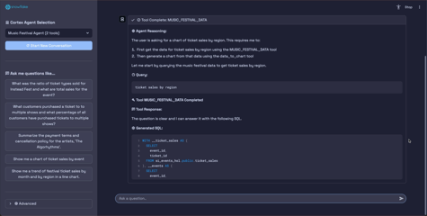

# Cortex Agent External Integration Demo

⚡ **A production-ready modular Streamlit application that demonstrates how to integrate Snowflake's Agentic AI Experience within any external application using the Cortex Agent REST API.**

*Right click the image and open the link in a new tab to view video.*

[](./media/demo.mp4)

## 🏗️ Architecture

This application features a **modular architecture** designed for enterprise use:

- **43-line entry point** (`streamlit_app.py`)
- **12 focused modules** with single responsibilities  
- **Clear separation of concerns** and well-defined interfaces
- **Comprehensive logging** and debugging capabilities
- **Type-safe data models** throughout

## 🎯 What This Application Does

This demo application allows you to:

- **Interact with ANY Cortex Agent** in your Snowflake account externally
- **Dynamic Agent Discovery** - Automatically lists all available Cortex Agents
- **Sample Questions** - Displays pre-configured sample questions for each agent
- **Real-time Streaming** - Server-Sent Events (SSE) for live response streaming with intelligent duplication prevention
- **Thread Management** - Maintains conversation context across multiple questions
- **Citation Support** - Displays clickable citations from Cortex Search results
- **Multiple Authentication Methods** - Supports RSA keys, passwords, and tokens

## 🚀 Key Features

### Dynamic Multi-Agent Support

- Automatically discovers all Cortex Agents in your account
- Switch between agents using a dropdown interface
- Each agent's sample questions are displayed dynamically
- Agent-specific configuration (database, schema, model) is used automatically

### Advanced Conversation Management

- **Thread Support**: Maintains conversation context across multiple questions
- **Citation Handling**: Displays source document references with clickable links
- **Real-time Streaming**: Live response updates using Server-Sent Events
- **Debug Mode**: Optional detailed logging for development/troubleshooting

### Flexible Authentication

- **RSA Key Authentication** (Recommended)
- **Username/Password Authentication**
- **Personal Access Token Authentication**
- **Multiple Configuration Options**: JSON file, environment variables, or Streamlit secrets

## 📋 Requirements

### System Requirements

- **Python 3.11+**
- **pip** (Python package manager)
- **Active Snowflake Account** with Cortex Agents configured

### Snowflake Requirements

- **Cortex Agents** must be available in your `SNOWFLAKE_INTELLIGENCE.AGENTS` schema
- **Appropriate Permissions** to access agents and execute queries
- **Authentication Credentials** (RSA key, username/password, or token)

## ⚙️ Installation & Setup

### Step 1: Clone/Download Repository

Ensure you have the complete modular application structure:

```text
streamlit_app.py                 # 43-line entry point
config.py                        # Central application configuration
modules/                         # Modular architecture (12 modules)
├── models/                      # Data models (messages, events, threads)
├── config/                      # Configuration management
├── api/                         # HTTP client and Cortex integration  
├── snowflake/                   # Snowflake client and agent management
├── threads/                     # Thread management
├── files/                       # File handling and preview
├── file_handling/               # File processing utilities (placeholder)
├── citations/                   # Citation processing and display
├── ui/                          # User interface components
├── authentication/              # Token generation and auth
├── logging/                     # Structured logging (structured, professional)
├── utils/                       # Text processing utilities
└── main/                        # Main application logic
requirements.txt                 # Dependencies
run_external_app.sh              # Installation script (macOS/Linux)
run_external_app.ps1             # Installation script (Windows)
README.md                        # Documentation
config.example                   # Configuration templates
```

### Step 2: Run the Installation Script

**For macOS/Linux:**

```bash
chmod +x run_external_app.sh
./run_external_app.sh
```

**For Windows:**

```powershell
powershell -ExecutionPolicy Bypass -File .\run_external_app.ps1
```

The script will:

- ✅ Install Python dependencies automatically
- ✅ Check for configuration files
- ✅ Launch the Streamlit application

### Step 3: Configuration

#### Application Configuration (`config.py`)

The `config.py` file contains **central application configuration** that controls the behavior, features, and appearance of the entire application. This file includes:

**Key Configuration Categories:**

- **Application Identification**: API client identification (`ORIGIN_APPLICATION`)
- **Feature Flags**: Enable/disable features like citations (`ENABLE_CITATIONS`), debug mode (`ENABLE_DEBUG_MODE`)
- **API Settings**: Timeouts, SSL verification, connection parameters (`API_TIMEOUT_MS`, `SNOWFLAKE_SSL_VERIFY`)
- **UI Configuration**: Page layout, avatars, branding (`PAGE_TITLE`, `LAYOUT`, `ASSISTANT_AVATAR`)
- **Display Limits**: Data processing and file handling limits (`MAX_DATAFRAME_ROWS`, `MAX_PDF_PAGES`)

**Important Settings:**

```python
# Application identifier (must be ≤16 characters for Snowflake API)
ORIGIN_APPLICATION = "ExtAgentApp"

# Feature toggles
ENABLE_CITATIONS = True
ENABLE_DEBUG_MODE = True

# API configuration
API_TIMEOUT_MS = 50000  # 50 seconds timeout
```

> ⚡ **Note**: Unlike Snowflake connection settings below, `config.py` is **tracked in Git** and contains application defaults. Modify this file to customize application behavior globally.

#### Snowflake Connection Configuration

The application supports **3 configuration methods** for Snowflake connectivity (in priority order):

> 💡 **Tip**: See `config.example` for complete configuration templates and examples

#### Option 1: Streamlit Secrets (Recommended)

Create: `.streamlit/secrets.toml` file

> **⚠️ Account Identifier Format**: If your account identifier contains underscores, replace them with hyphens.
> Example: `myorg-my_account` → `myorg-my-account`

**Using RSA Key Authentication:**

```toml
[snowflake]
account = "orgname-accountname"
user = "your_username"
private_key_path = "/Library/Application Support/Snowflake/rsa_key.p8"
database = "SNOWFLAKE_INTELLIGENCE"
schema = "AGENTS"
warehouse = "your_warehouse"
```

**Using Programmatic Access Token:**

```toml
[snowflake]
account = "orgname-accountname"
user = "your_username"
password = "your_programmatic_access_token"
database = "SNOWFLAKE_INTELLIGENCE"
schema = "AGENTS"
warehouse = "your_warehouse"
```

> 💡 **Programmatic Access Token**: You can use a Snowflake Programmatic Access Token in the `password` field instead of your actual password for enhanced security.

#### Option 2: JSON Configuration

Create: `/Library/Application Support/Snowflake/config.json`

> **⚠️ Account Identifier Format**: If your account identifier contains underscores, replace them with hyphens.
> Example: `myorg-my_account` → `myorg-my-account`

```json
{
    "account": "orgname-accountname",
    "user": "your_username",
    "private_key_path": "/Library/Application Support/Snowflake/rsa_key.p8",
    "database": "SNOWFLAKE_INTELLIGENCE",
    "schema": "AGENTS",
    "warehouse": "your_warehouse"
}
```

#### Option 3: Environment Variables

Create: `.env` file in project directory

> **⚠️ Account Identifier Format**: If your account identifier contains underscores, replace them with hyphens.
> Example: `myorg-my_account` → `myorg-my-account`

```bash
SNOWFLAKE_ACCOUNT=orgname-accountname
SNOWFLAKE_USER=your_username
SNOWFLAKE_PRIVATE_KEY_PATH=/Library/Application Support/Snowflake/rsa_key.p8
SNOWFLAKE_DATABASE=SNOWFLAKE_INTELLIGENCE
SNOWFLAKE_SCHEMA=AGENTS
SNOWFLAKE_WAREHOUSE=your_warehouse
```

### Step 4: RSA Key Setup (if using RSA authentication)

1. Place your RSA private key at: `/Library/Application Support/Snowflake/rsa_key.p8`
2. Ensure proper permissions: `chmod 600 /Library/Application Support/Snowflake/rsa_key.p8`

## 🏃‍♂️ Running the Application

### Automatic Launch (Recommended)

**macOS/Linux:**

```bash
chmod +x run_external_app.sh
./run_external_app.sh
```

**Windows:**

```powershell
powershell -ExecutionPolicy Bypass -File .\run_external_app.ps1
```

### Manual Launch

```bash
pip install -r requirements.txt
streamlit run streamlit_app.py
```

### Access the Application

Open your browser to: **<http://localhost:8501>**

## 🎮 Using the Application

### 1. Select an Agent

- Use the dropdown in the sidebar to select any available Cortex Agent
- Agent details (database, schema, tools) are displayed automatically

### 2. Ask Questions

- **Use Sample Questions**: Click any pre-configured sample question button
- **Type Custom Questions**: Use the chat input at the bottom
- **Follow-up Questions**: Ask additional questions to continue the conversation

### 3. View Responses

- **Real-time Streaming**: Watch responses appear in real-time
- **Citations**: Click on citation links to view source documents
- **Thread Context**: Previous conversation context is maintained automatically

### 4. Advanced Features

- **Debug Mode**: Enable in sidebar to see detailed API communication
- **Start Over**: Reset conversation thread at any time
- **Multiple Agents**: Switch between different agents seamlessly
- **Custom Theme**: Beautiful Catppuccin Mocha color palette for enhanced visual experience
- **Professional Typography**: Custom font stack including Space Grotesk and Roboto Mono

## 🔧 Troubleshooting

### Common Issues

#### "No Agent Selected" Warning

- **Cause**: No agents found in `SNOWFLAKE_INTELLIGENCE.AGENTS`
- **Solution**: Verify agents exist and you have proper permissions

#### Authentication Errors

- **Cause**: Invalid credentials or missing configuration
- **Solutions**:
  - Check config file format and values
  - Verify RSA key permissions (600)
  - Ensure Snowflake account/user are correct
  - **Account Format**: If your account identifier has underscores, replace with hyphens (e.g., `myorg-my_account` → `myorg-my-account`)

#### Connection Issues

- **Cause**: Network connectivity or Snowflake service issues
- **Solutions**:
  - Check internet connection
  - Verify Snowflake account URL
  - Try different authentication method

#### Missing Dependencies

- **Cause**: Python packages not installed
- **Solution**: Run `pip install -r requirements.txt`

### Debug Mode

Enable "Activate Debug Mode" in the sidebar to see:

- ✅ Detailed API request/response logging
- ✅ Authentication method being used
- ✅ Thread and message ID tracking
- ✅ Citation processing details

## 🏗️ Technical Architecture

### Modular Design

The application follows **enterprise-grade modular architecture**:

- **Entry Point**: `streamlit_app.py` (43 lines) → `modules.main.main()`
- **12 Focused Modules**: Each with single responsibility and clear interfaces
- **Type Safety**: Comprehensive data models throughout
- **Professional Logging**: Enhanced structured logging with rich formatting
- **Enterprise Standards**: Production-ready code quality throughout

### Core Components

- **modules/ui/**: Interactive Streamlit interface components with custom Catppuccin Mocha theme and professional typography
- **modules/api/**: Cortex Agent REST API integration and streaming
- **modules/snowflake/**: Snowflake client and agent discovery
- **modules/threads/**: Thread management and conversation context
- **modules/models/**: Type-safe data structures (messages, events, threads)
- **modules/config/**: Configuration management and session state
- **modules/authentication/**: JWT token generation and auth
- **modules/files/**: File handling and document preview
- **modules/file_handling/**: File processing utilities (placeholder module)
- **modules/citations/**: Citation processing and display system
- **modules/logging/**: Professional structured logging (structlog + rich)
- **modules/utils/**: Text processing and utility functions

### Module Architecture

```text
streamlit_app.py (Entry Point)
        ↓
modules/main/app.py (Orchestration)
        ↓
┌──────────────────────────────────────────────┐
│  modules/ui/         │  modules/config/      │
│  modules/api/        │  modules/models/      │  
│  modules/threads/    │  modules/auth/        │
│  modules/files/      │  modules/file_handling│
│  modules/citations/  │  modules/logging/     │
│  modules/utils/      │                       │
└──────────────────────────────────────────────┘
        ↓
Cortex Agents API
```

### API Integration

- **Agent Discovery**: `GET /api/v2/cortex/agents`
- **Thread Creation**: `POST /api/v2/cortex/threads`
- **Agent Execution**: `POST /api/v2/cortex/agents/{agent}/runs`
- **Thread Retrieval**: `GET /api/v2/cortex/threads/{thread_id}`

## 🔐 Security Notes

- **RSA Keys**: Store private keys securely with proper permissions (600)
- **Configuration Files**: Keep sensitive data in secure locations
- **Network Security**: Application runs on localhost by default
- **Authentication**: Support for multiple secure authentication methods

## 🚀 Modular Architecture Benefits

### For Developers

- **Easy Onboarding**: Clear module structure and comprehensive documentation
- **Better Debugging**: Module-specific logging and isolated functionality
- **Easy Extension**: Add new features as new modules
- **Type Safety**: Full type hints and IDE support throughout

### For Operations  

- **Maintainability**: Changes to one module don't affect others
- **Scalability**: Modular design supports team development
- **Testing**: Individual modules can be tested in isolation
- **Performance**: Load only needed components
- **Visual Design**: Custom Catppuccin Mocha theme with professional typography (Poppins, Space Grotesk, Roboto Mono)
- **User Experience**: Carefully crafted interface with modern design principles

## ✨ Recent Enhancements

### 🔧 Streaming & Thread Management ✅ COMPLETED

**Major Update**: Request-scoped content management and intelligent agent response handling

**Problems Solved**:

1. **Thread Content Integrity**: Content from previous requests could be overwritten by subsequent requests, causing parts of responses to disappear
2. **Response Duplication**: Agent re-evaluation during streaming caused duplicate content to appear in the UI
3. **Conversation History Persistence**: Charts and tables from previous responses were not persisting in conversation history

**Solutions Implemented**:

- **Request-Scoped Content Keys**: Uses `(request_id, content_index)` composite keys to isolate content per request
- **Thread Integrity Protection**: Each request maintains its own content namespace within threads
- **Safe Agent Re-evaluation**: Re-evaluation only affects current request, preserving previous responses
- **Smart Duplication Prevention**: Automatically detects and handles agent re-evaluation to eliminate duplicate content
- **Smart Content Retrieval**: Automatically locates correct request IDs for charts and tables to ensure conversation history persistence
- **Complete Thread History**: All content types (text, tables, charts, citations) persist across requests

**Architecture Impact**:

```text
Thread (Before - BROKEN)
├── Request A: content_index 0, 1, 2
├── Request B: content_index 0, 1, 2  ← OVERWRITES Request A!

Thread (After - FIXED)  
├── Request A: (req_A, 0), (req_A, 1), (req_A, 2)  ← PROTECTED
├── Request B: (req_B, 0), (req_B, 1), (req_B, 2)  ← ISOLATED
```

**Technical Implementation**:

- Enhanced `stream_events_realtime()` function with request ID extraction from `X-Snowflake-Request-Id` header
- Updated all content management functions to use request-scoped keys
- Added intelligent agent re-evaluation state tracking and content cleanup logic
- Implemented smart content retrieval system that automatically finds correct request IDs for charts and tables
- Enhanced conversation history persistence with content-specific request ID detection

### 🏗️ Architecture & Code Quality ✅ COMPLETED

**Professional Development Standards**: Enterprise-ready codebase with modern tooling

**Key Improvements**:

- **Modular Architecture**: Refactored from 2,551-line monolith into 12 focused modules with clear responsibilities
- **Professional Documentation**: Production-ready documentation replacing debugging-style comments
- **Structured Logging**: Added `structlog` and `rich` for professional output formatting throughout all modules
- **Type Safety**: Comprehensive type hints and dataclass-based models
- **Modern Python**: Updated requirements from Python 3.8+ to **Python 3.11+** for enhanced features and security

**Enhanced Dependencies**:

- `structlog>=23.2.0` - Professional structured logging
- `rich>=13.0.0` - Enhanced console formatting and debugging
- `watchdog>=6.0.0` - File system monitoring for configuration changes

## 📚 Documentation & Resources

### Application Documentation (docs/)

- **`modular_architecture_guide.md`** - Complete module overview and patterns
- **`project_overview.md`** - Architecture diagrams and integration patterns  
- **`streamlit_app_documentation.md`** - Detailed application documentation
- **`models_documentation.md`** - Data models and API structures
- **`startup_script_documentation.md`** - Installation and deployment guide

### External Resources

- **Cortex Agent Documentation**: <https://docs.snowflake.com/en/user-guide/snowflake-cortex/cortex-agents>
- **Cortex Agent REST API**: <https://docs.snowflake.com/en/user-guide/snowflake-cortex/cortex-agents-rest-api>
- **Thread Management**: <https://docs.snowflake.com/en/user-guide/snowflake-cortex/cortex-agents-threads-rest-api>

## 🤝 Support

For issues or questions:

1. **Check Documentation**: Review the comprehensive docs in `docs/` directory
2. **Enable Debug Mode**: Gather detailed logs for troubleshooting
3. **Module-Specific Issues**: Check the relevant module documentation
4. **Architecture Questions**: See `docs/modular_architecture_guide.md`
5. **Verify Configuration**: Check your Cortex Agent setup in Snowflake
6. **Review Official Docs**: Snowflake Cortex Agent documentation

## 🙏 Acknowledgements

This application project is built upon the strong foundational work developed by **Jeevan Rag**. His original implementation provided the essential groundwork that enabled the evolution into this comprehensive, enterprise-ready modular architecture.

## 👨‍💻 Author

**Tom Meacham**  
*Senior Solutions Engineer, Snowflake*

Responsible for the complete architectural refactoring, modularization, and professional enhancement of this Cortex Agent external integration demo. Transformed the original implementation into an enterprise-ready, production-quality application with comprehensive documentation and modern development standards.

*Developed with the assistance of Cursor AI for enhanced productivity and code quality.*

---

Built with ❤️ using **Modular Architecture**, Streamlit, and Snowflake Cortex Agents

## ⚠️ Important Disclaimer

This project is NOT an official Snowflake product or service.

PDF Cleaver is an independent, community-developed application that utilizes Snowflake's platform capabilities. This software is provided "AS IS" without warranty of any kind, express or implied.

## 🔒 Use at Your Own Risk

- **No Official Support**: This is not supported by Snowflake Inc.
- **Community Project**: Developed independently by community members
- **No Warranties**: No guarantees of functionality, performance, or suitability
- **Your Responsibility**: Users are responsible for testing, validation, and compliance
- **Data Security**: Review and validate all security aspects for your environment
- **Production Use**: Thoroughly test before deploying in production environments

## 📋 Legal Notice

- **MIT License**: See LICENSE file for complete terms
- **Third-Party Dependencies**: This project uses various open-source libraries
- **Snowflake Trademarks**: Snowflake® is a registered trademark of Snowflake Inc.
- **Independent Development**: Not affiliated with, endorsed by, or sponsored by Snowflake Inc.

## 🛡️ Best Practices

Before using PDF Cleaver in your environment:

- ✅ Review all code and dependencies
- ✅ Test thoroughly with non-production data
- ✅ Validate security and compliance requirements
- ✅ Ensure proper backup and recovery procedures

**Use this software at your own discretion and risk.**
